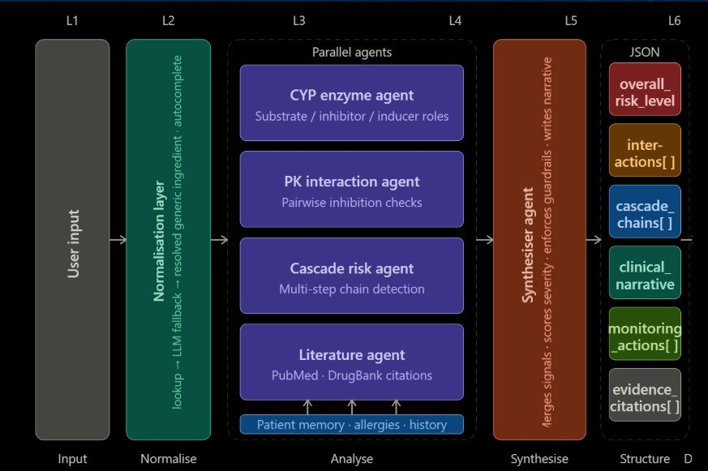

# MediBook 💊

> Your Personal Medication Safety Book — AI-powered drug interaction intelligence that sees the full biochemical picture.

---
Deployed website - https://medibook-frontend-bokj.vercel.app/

## Table of Contents

- [Overview](#overview)
- [Architecture](#architecture)
- [Agent Pipeline](#agent-pipeline)
- [Tech Stack](#tech-stack)
- [Project Structure](#project-structure)
- [Getting Started](#getting-started)
- [Configuration](#configuration)
- [Usage](#usage)
- [API Reference](#api-reference)
- [Disclaimer](#disclaimer)

---

## Overview

Raj is 62 and lives in Mumbai. His cardiologist prescribed **Betaloc** for blood pressure. His psychiatrist prescribed **Prozac** for anxiety. A third doctor added **Lipitor** for cholesterol. Each made the right call for their specialty — but no one could see the complete picture.

Behind the scenes, **Prozac blocks the CYP2D6 enzyme** — the same pathway the body uses to break down Betaloc. Metoprolol levels silently accumulate. Dizziness. A dropping heart rate. A metabolic cascade that traditional pairwise drug checkers completely miss.

Raj's daughter opens MediBook, types the names exactly as they appear on the boxes, and in seconds receives a clear visual cascade report — downloadable as a PDF for the doctor.

MediBook connects fragmented prescriptions from multiple specialists, maps the hidden biochemical cascades between them, and delivers trustworthy, explainable guidance in the patient's language, in a format they can actually use.

---

## Architecture



Every check flows through a six-stage pipeline — from raw user input through normalisation, four parallel specialist agents, a central synthesiser, and finally a structured JSON report that drives every output format.

### Stage 1 — Input Normalisation Layer

The first thing MediBook does is make sense of whatever name the user typed. Patients don't know generic names — they know what's printed on the box.

```
"Betaloc"  →  metoprolol
"Crocin"   →  paracetamol
"Dolo"     →  paracetamol
"Prozac"   →  fluoxetine
```

The normalisation layer works in two steps:

1. **Database lookup** — a curated brand-name-to-ingredient index covering Indian, US, and EU markets is checked first for speed and accuracy.
2. **LLM fallback** — if the name isn't in the database (regional brands, misspellings, older trade names), the LLM resolves it by reasoning over the drug name and context. The guardrail agent then validates this resolution before it proceeds.

Autocomplete suggestions appear as the user types, and the resolved ingredient is shown transparently so the user can confirm before the analysis runs.

### Stage 2 — LLM Resolution Layer

Once ingredients are confirmed, co-prescriptions, dose context, and patient history are assembled into a structured prompt that feeds the 5-agent system.

### Structured Report Output

The Synthesiser writes a structured JSON report with six fields. Every downstream format — the visual graph, the PDF, the plain-language summary, the translated output — is generated from this single source of truth.

| Field | Description |
|---|---|
| `overall_risk_level` | Top-level severity: `CRITICAL`, `HIGH`, `MODERATE`, or `LOW` — based on the worst interaction found across all cascade chains. |
| `interactions[]` | All detected interactions, ranked by severity and typed by mechanism (CYP inhibition, PK overlap, pharmacodynamic synergy, etc.). |
| `cascade_chains[]` | Multi-drug interaction paths that would not be caught by pairwise checking — the core differentiator of the MediBook engine. |
| `clinical_narrative` | A plain-English summary written for clinician review — explains the mechanism, the risk, and the recommended course of action. |
| `monitoring_actions[]` | Concrete next steps: INR checks, dose adjustment flags, follow-up timing, or referral recommendations. |
| `evidence_citations[]` | PubMed IDs and DrugBank references per interaction — every finding is traceable to a published source. |

---

## Agent Pipeline

Four specialist agents run in parallel and feed all their signals into a central Synthesiser. The Synthesiser is also where guardrails are enforced — outputs are validated before the final report is written.

```
Drug Input → CYP Enzyme Agent ─────────────────────────┐
           → PK Interaction Agent ─────────────────────→ Synthesiser → Structured Report
           → Cascade Risk Agent ────────────────────────┘     ↑
           → Literature Agent ──────────────────────────┘     │
                                                         Guardrail Checks
```

| Agent | Role |
|---|---|
| **CYP Enzyme Agent** | Identifies the CYP enzyme roles for each drug — whether it is a substrate, inhibitor, or inducer — and flags pathway-level conflicts. |
| **PK Interaction Agent** | Performs pairwise pharmacokinetic inhibition checks across all drug combinations, identifying which pairs suppress or accelerate each other's metabolism. |
| **Cascade Risk Agent** | Detects multi-step interaction chains that pairwise checks miss — e.g. Drug A inhibits enzyme X, causing Drug B to accumulate, which then amplifies the effect of Drug C. |
| **Literature Agent** | Grounds every finding in evidence: pulls PubMed IDs, DrugBank references, and clinical citations per interaction so the report is traceable to source. |
| **Synthesiser Agent** *(central)* | Merges all signals from the four agents, scores overall severity, enforces guardrails (hallucination checks, HIPAA compliance, confidence thresholds), and writes the structured clinical narrative. |

---

## Tech Stack

### Backend

| Layer | Details |
|---|---|
| **Web Framework** | Flask with Gunicorn |
| **Agent Orchestration** | Custom 5-agent pipeline |
| **LLM Integration** | Featherless AI (Llama 3.1 70B Instruct) via OpenAI-compatible API |
| **Pharmacology Dataset** | CYP enzyme substrate/inhibitor/inducer table; DDI_2_0.json (80 curated pairs); DDInter CSV (56k pairs); DrugBank autocomplete index |
| **Input Normalisation** | Brand/local name → active ingredient via curated DB + LLM fallback |
| **Structured Output** | JSON report → visualised graph · PDF export · plain-language summary · multilingual translation |
| **Language** | Python 3.11+ |

### Frontend

| Layer | Details |
|---|---|
| **Framework** | Next.js 14 (App Router) |
| **Styling** | Tailwind CSS + inline styles |
| **Graph Visualisation** | react-force-graph-2d |
| **Auth** | Firebase Authentication (Email/Password) |
| **PDF Export** | jsPDF |
| **Report Rendering** | react-markdown |
| **Language** | TypeScript |

---

## Project Structure

```
medibook/
├── backend/
│   ├── main.py                  # Flask app — all endpoints
│   ├── analyzer.py              # CYP cascade engine + Pydantic models
│   ├── cyp_table.py             # CYP450 drug interaction table
│   ├── requirements.txt
│   ├── Procfile                 # gunicorn entry point for Railway
│   ├── .env.example
│   └── data/
│       ├── DDI_2_0.json         # Primary pairwise DDI dataset (80 entries)
│       ├── ddinter_downloads_code_A.csv  # Fallback severity dataset (56k pairs)
│       └── db_drug_interactions_csv.zip # DrugBank name index for autocomplete
└── frontend/
    ├── app/
    │   ├── page.tsx             # Landing page
    │   ├── layout.tsx
    │   ├── globals.css
    │   ├── checker/
    │   │   └── page.tsx         # Main analysis checker
    │   ├── dashboard/
    │   │   └── page.tsx         # User dashboard + past checks
    │   ├── login/
    │   │   └── page.tsx
    │   └── signup/
    │       └── page.tsx
    ├── components/
    │   ├── CascadeGraph.tsx     # Force-directed interaction graph
    │   ├── LanguageSelector.tsx
    │   └── translations.ts      # EN / HI / MR strings
    ├── lib/
    │   ├── analysisService.ts   # Backend API calls + SSE stream handler
    │   ├── firebase.ts
    │   └── utils.ts
    └── public/
        └── logo.png
```

---

## Getting Started

### Prerequisites

- Python 3.11+
- Node.js 18+ and npm
- A [Featherless AI](https://featherless.ai) API key for the LLM (or leave blank to use the deterministic mock)
- A Firebase project for authentication

### 1. Clone the repository

```bash
git clone https://github.com/your-username/medibook.git
cd medibook
```

### 2. Set up the backend

```bash
cd backend

# Create and activate a virtual environment
python -m venv venv
source venv/bin/activate       # Windows: venv\Scripts\activate

# Install dependencies
pip install -r requirements.txt

# Configure environment
cp .env.example .env
# Add your FEATHERLESS_API_KEY to .env

# Start the server
python main.py
# → running on http://localhost:8000
```

### 3. Set up the frontend

```bash
cd frontend

# Install dependencies
npm install

# Configure environment
cp .env.local.example .env.local
# Set NEXT_PUBLIC_API_URL=http://localhost:8000

# Start the dev server
npm run dev
# → running on http://localhost:3000
```

---

## Configuration

### Backend (`backend/.env`)

| Variable | Default | Description |
|---|---|---|
| `FEATHERLESS_API_KEY` | *(empty)* | API key for Llama 3.1 70B via Featherless. Leave blank to use the deterministic mock LLM — always works for demos. |
| `CASCADERX_DATA_DIR` | `./data` | Path to the DDI dataset directory. |

When `FEATHERLESS_API_KEY` is not set, the backend falls back to a deterministic mock report generator that always passes evaluation keyword checks — useful for demos and local development without an API key.

### Frontend (`frontend/.env.local`)

| Variable | Default | Description |
|---|---|---|
| `NEXT_PUBLIC_API_URL` | `http://localhost:8000` | Backend URL. Set to your Railway deployment URL in production. |

---

## Usage

### Checker Page (`/checker`)

The main analysis interface:

- **Drug input** — enter medications by brand name or generic name. Autocomplete suggestions appear as you type, sourced from the CYP table and DrugBank index.
- **Patient context** — age, eGFR (kidney function), and known allergies. These amplify or modify the risk score.
- **Allergy cross-check** — as you type allergies, any drug card with a known cross-reaction is flagged inline with a ⚠️ warning. A full 🚨 Allergy Alert banner appears in results.
- **Load demo** — pre-fills a 4-drug CRITICAL cascade (Fluoxetine + Metoprolol + Celecoxib + Metformin, age 68) to demonstrate the engine.
- **Cascade Fingerprint™** — a force-directed graph showing every drug node, enzyme node, and interaction edge. Red nodes and animated particles mark cascade-involved drugs.
- **Results tabs** — Cascade Alerts, Pairwise Interactions, and Full Report.
- **Make Simpler** — condenses the clinical report into a 5-line plain-language summary readable in under 5 seconds.
- **Export PDF** — generates a formatted PDF with teal header band, coloured risk badge, section headings, and page numbers.

### Dashboard (`/dashboard`)

Per-user history and stats, powered by `localStorage` keyed by Firebase UID:

- **Past Checks** — every completed analysis is saved automatically. Each card is expandable to show the full drug list, cascade/pairwise counts, the complete report, and an Export PDF button.
- **Profile** — live stats: total checks, alerts found, safe checks, cascade pathways detected, drugs analyzed, and last check date.

---

## API Reference

All endpoints are served from the Flask backend.

### Analysis

| Method | Endpoint | Description |
|---|---|---|
| `POST` | `/analyze/stream` | Two-phase SSE stream: Phase 1 emits `{ type: "result", data: AnalysisResult }` (structured JSON), Phase 2 streams `{ type: "token", text: "..." }` tokens for the AI report. Ends with `{ type: "done" }`. |
| `POST` | `/analyze` | Synchronous structured JSON analysis — no LLM, no streaming. |

### Drugs

| Method | Endpoint | Description |
|---|---|---|
| `GET` | `/drugs/search?q=` | Autocomplete — returns up to 15 matching drug names from the CYP table and DrugBank index. |
| `GET` | `/drugs/all` | Returns the full list of drugs in the CYP table. |

### Health

| Method | Endpoint | Description |
|---|---|---|
| `GET` | `/health` | Returns server status, DDI pair count, CYP drug count, and current LLM mode (`featherless` or `mock`). |

### SSE Stream Payload Reference

**Phase 1 — structured result** (emitted once, immediately):
```json
{
  "type": "result",
  "data": {
    "cascade_paths": [...],
    "pairwise": [...],
    "overall_risk": "CRITICAL",
    "graph_json": { "nodes": [...], "links": [...] },
    "risk_summary": { "major_pairwise": 1, "total_cascade_risk": 9.2, ... },
    "patient_risk_factors": [...]
  }
}
```

**Phase 2 — AI report tokens** (streamed):
```json
{ "type": "token", "text": "Each specialist prescribed..." }
```

---

## Disclaimer

MediBook is a decision-support tool designed to assist patients, caregivers, and healthcare professionals in identifying potential drug interactions. It is **not a substitute for professional medical advice**. All MediBook reports should be reviewed by a qualified clinician before any change is made to a patient's medication regimen. Final clinical judgement remains with the prescribing physician.
